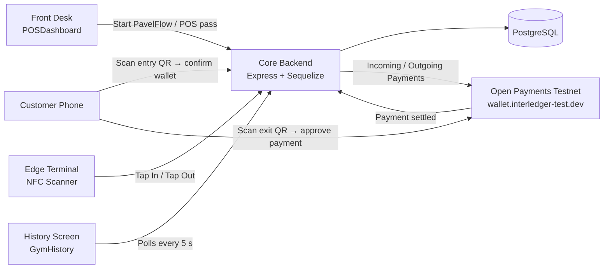
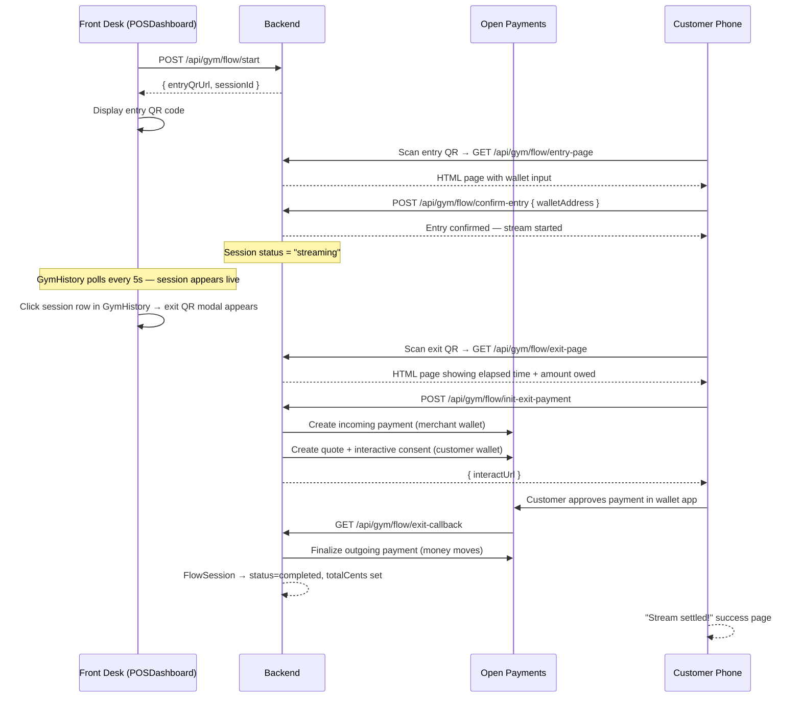
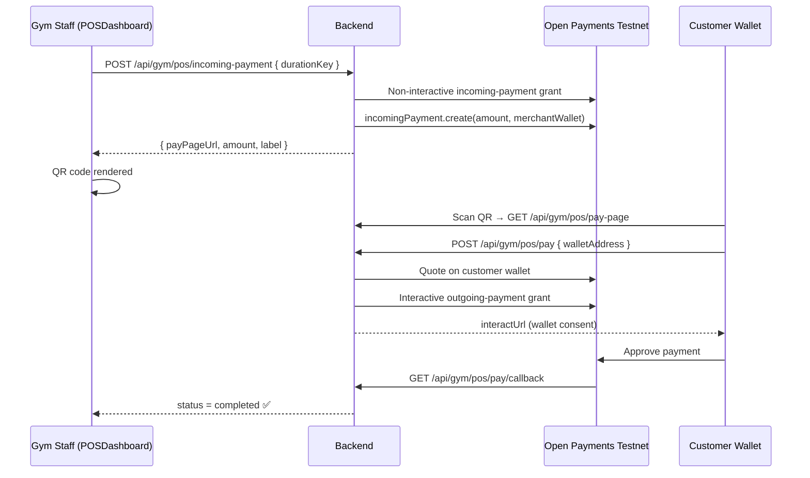
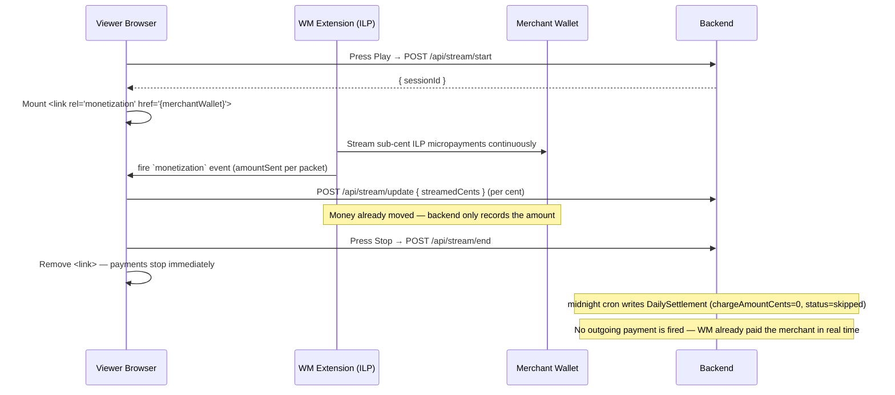
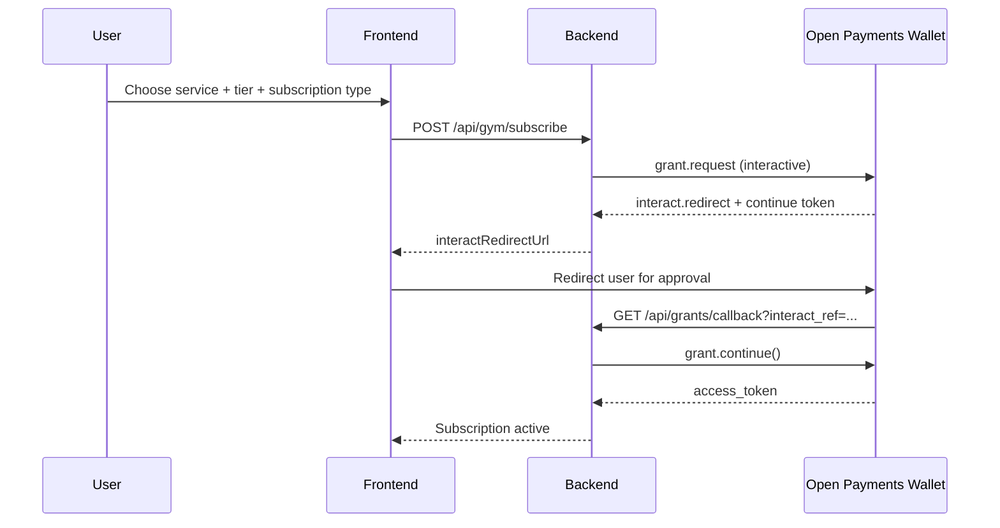
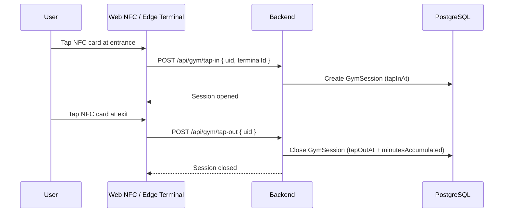
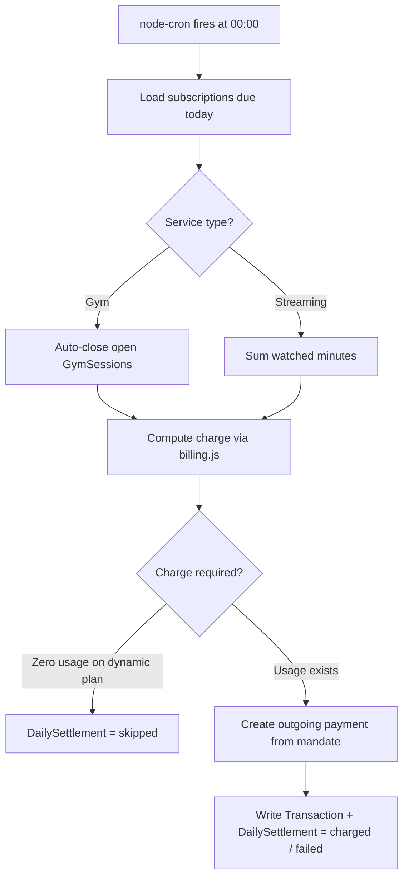

# PavelPayments

**PavelPayments** is a usage-based micropayment platform built on [Interledger Open Payments](https://openpayments.dev/), demonstrated as a gym + streaming service. It shows how to connect real usage events to real money movement — no fixed monthly bills, no pre-authorised lump sums. You pay exactly for what you use, settled the moment you walk out.

Built for the hackathon in three interconnected layers:
- **PavelGym** — tap-in/tap-out gym access with dynamic pricing and instant QR passes
- **PavelFlow** — streaming micropayment sessions: the meter runs while you train, stops the moment you exit
- **PavelFlix** — video streaming paid by the second using the **Web Monetization standard** — the browser streams micropayments directly to the merchant wallet while the video plays

> **Two different ways money moves in this project:**
> - **PavelFlix** uses real [Web Monetization (WM v2)](https://webmonetization.org/specification/): a `<link rel="monetization">` tag in the page causes a WM-enabled browser to stream ILP micropayments directly from the viewer's wallet to the merchant — no backend payment code involved.
> - **PavelFlow** uses the [Open Payments](https://openpayments.dev/) GNAP flow: the backend orchestrates a quote, interactive consent, and outgoing payment — one settlement transaction at the moment the customer walks out.

---

## Table of Contents

1. [What This Project Does](#what-this-project-does)
2. [System Architecture](#system-architecture)
3. [End-to-End Flows](#end-to-end-flows)
   - PavelFlow — streaming gym session
   - POS instant payment (QR demo)
   - Subscription and wallet authorization
   - Gym tap in / tap out
   - Midnight settlement
4. [Business Logic](#business-logic)
5. [Repository Layout](#repository-layout)
6. [Local Setup](#local-setup)
7. [Running the Demo](#running-the-demo)
8. [API Reference](#api-reference)
9. [Troubleshooting](#troubleshooting)
10. [Developer Notes](#developer-notes)

---

## What This Project Does

### The core idea

Traditional billing stores your card and charges you later. Interledger lets us charge you **now**, for **exactly** what you used, straight from your wallet to the merchant — no intermediary holding your card details.

This project demonstrates three billing patterns on a single backend:

| Pattern | Where | How |
|---------|-------|-----|
| **Browser micropayment stream** | PavelFlix | `<link rel="monetization">` → WM-enabled browser streams ILP payments directly to merchant wallet while video plays. **No charge at midnight — money already moved.** |
| **Micropayment on exit** | PavelFlow (gym) | Meter runs while inside; one Open Payments transaction on the way out |
| **Instant fixed-amount QR** | POS Terminal (gym) | Merchant creates incoming payment; customer scans QR and confirms |
| **Midnight batch settlement** | Gym subscriptions | Usage accumulated during the day; single outgoing payment at midnight |

### What a judge sees in a live demo

1. Front desk taps **"Start PavelFlow Session"** — a QR code appears.
2. Customer scans the QR on their phone, types their Interledger wallet address, confirms entry.
3. The History screen shows the session ticking up in real time: elapsed time and running total.
4. When the customer leaves, front desk clicks the session row — an exit QR appears.
5. Customer scans the exit QR, sees the exact amount owed, taps **"Pay & Exit"** in their wallet app.
6. The session closes in the History screen immediately. Money has moved.

---

## System Architecture



### Component responsibilities

| Component | Role |
|-----------|------|
| **POSDashboard** | Front desk terminal — start PavelFlow sessions, sell instant QR passes |
| **GymHistory** | Live view of active streams, all-time visit history, exit QR modal, customer name management |
| **PavelFlix** | Video streaming via Web Monetization — `<link rel="monetization">` streams ILP micropayments directly while the video plays |
| **Core Backend** | All API endpoints, session tracking, payment orchestration, midnight settlement |
| **Edge Terminal** | Physical NFC tap events pushed to backend |
| **PostgreSQL** | Users, sessions (GymSession, FlowSession, StreamSession), settlements, transactions |

---

## End-to-End Flows

### 1. PavelFlow — streaming gym session (the headline feature)



**Daily cap logic:** before charging, the backend sums all completed FlowSessions for that wallet address today. The customer can never be charged more than the Day Pass maximum ($60) across all their sessions in a calendar day.

---

### 2. POS instant payment (QR demo)



---

### 3. PavelFlix — Web Monetization streaming



---

### 4. Subscription and wallet authorization



---

### 4. Gym NFC tap in / tap out



---

### 5. Midnight settlement



> **Note:** PavelFlow sessions are settled at exit time (not at midnight) — the customer pays the moment they leave, not the next morning.

---

## Business Logic

### PavelFlow (streaming gym sessions)

| Parameter | Value |
|-----------|-------|
| Rate | $0.50 / minute |
| Daily cap | $60.00 (same as Day Pass) |
| Cap scope | Per wallet address, per calendar day (all sessions summed) |
| Payment timing | At exit — one Open Payments transaction for the exact amount |

The daily cap means: if a customer already paid $40 in a morning session and returns in the evening, they can be charged at most $20 more that day. If the cap is already exhausted, the session closes at $0 with no payment request.

### POS access passes (instant QR)

| Pass | Amount |
|------|--------|
| 30 Min Pass | R15.00 |
| 1 Hour Pass | R30.00 |
| 2 Hour Pass | R50.00 |
| Day Pass | R60.00 |
| Weekly Pass | R140.00 |
| Monthly Pass | R400.00 |
| Yearly Pass | R800.00 |

### Gym subscription (dynamic pricing)

```
charge = base_rate − duration_discount + peak_adjustment
```

- **base_rate**: daily=$6, weekly=$5, monthly=$4, yearly=$3
- **duration_discount**: 0–50% as usage grows from 0 to 120 min
- **peak_adjustment**: +$0.50 if majority of usage in peak hours (06–09, 17–20), −$0.30 otherwise
- Zero usage on a dynamic plan → settlement skipped, no charge

### Gym subscription (static flat pricing)

| Tier | Charge |
|------|--------|
| Daily | $6.00 |
| Weekly | $28.00 |
| Monthly | $80.00 |
| Yearly | $800.00 |

### PavelFlix (Web Monetization streaming)

PavelFlix uses the [Web Monetization specification](https://webmonetization.org/specification/) — a browser standard where a `<link rel="monetization" href="{walletAddress}">` tag signals the browser to stream micropayments over Interledger while the page is active.

**How it works in the code:**

1. `useWebMonetization` hook mounts `<link rel="monetization" href={NEXT_PUBLIC_WALLET_ADDRESS}>` in `<head>` when play is pressed
2. A WM-enabled browser (e.g. with the Interledger extension) reads the tag and begins streaming sub-cent ILP payments directly from the viewer's wallet to the merchant — the backend is **not** in the payment path
3. The browser fires a `monetization` event on the link element for each payment sent, carrying `amountSent.value` and `amountSent.currency`
4. The hook accumulates sub-cent amounts precisely and calls `onPayment(cents)` every time a whole new cent is crossed
5. The player reports each increment to the backend → `StreamSession.streamedCents` grows in real time
6. At midnight, the settlement cron charges the total as a single outgoing Open Payments transaction

**Demo fallback:** if no WM-enabled browser is present (`link.relList.supports("monetization")` returns false), a configurable ticker (`NEXT_PUBLIC_STREAM_RATE_CENTS_PER_MIN`, default 12¢/min) simulates the stream so the live UI still works during demos. Real payments take over automatically and disable the fallback.

| Parameter | Value |
|-----------|-------|
| Fallback demo rate | 12¢ / min (configurable) |
| Settlement timing | **None** — WM already paid the merchant in real time |
| Midnight cron | Writes a `DailySettlement` record for history only (`chargeAmountCents=0`, `status=skipped`) |
| Subscription rates | daily=5¢/min · weekly=4¢ · monthly=3¢ · yearly=2¢ |

---

## Repository Layout

```
apps/
  core-backend/         Express API, billing engine, settlement cron, Open Payments integration
    src/
      controllers/
        gymController.js    All gym + PavelFlow endpoints + payment orchestration
      models/
        index.js            Sequelize models: User, GymSession, FlowSession, DailySettlement, ...
      services/
        billing.js          Pricing formulas
        gym-session.js      Tap in/out logic
        settlement.js       Midnight cron job
        pos-payment.js      Incoming payment creation + interactive grant flow
        open-payments.js    Open Payments SDK client
  edge-terminal/        NFC event sender (physical demo hardware)
  web-client/           Next.js app
    src/
      pages/
        POSDashboard.tsx    Front desk terminal (POS + PavelFlow start)
        GymHistory.tsx      Live sessions, all-time history, exit QR, name management
        StreamingDashboard.tsx  PavelFlix dashboard
        Dashboard.tsx       Gym subscription dashboard
keys/
  private.key           Local Ed25519 signing key (never commit)
  public.json           JWKS uploaded to wallet testnet
docker-compose.yml      PostgreSQL + Redis
```

---

## Local Setup

### Prerequisites

- Docker Desktop running
- Node.js 20+
- Testnet wallet at [wallet.interledger-test.dev](https://wallet.interledger-test.dev/)

### 1. Generate keys

```bash
node -e "
const { generateKeyPairSync } = require('crypto');
const fs = require('fs');
const { privateKey, publicKey } = generateKeyPairSync('ed25519');
fs.writeFileSync('./keys/private.key', privateKey.export({ type:'pkcs8', format:'pem' }));
const jwk = publicKey.export({ format:'jwk' });
fs.writeFileSync('./keys/public.json', JSON.stringify({ keys: [{ ...jwk, kid: 'key-1', alg: 'EdDSA' }] }, null, 2));
console.log('Keys written');
"
```

Upload `keys/public.json` to your testnet wallet under **Developer Keys**. Copy the generated key ID.

### 2. Configure `.env`

```env
POSTGRES_HOST=localhost
POSTGRES_PORT=5432
POSTGRES_DB=pavel_payments
POSTGRES_USER=postgres
POSTGRES_PASSWORD=your_password

REDIS_URL=redis://localhost:6379

# Your signing wallet (used to authenticate SDK calls)
WALLET_ADDRESS=https://ilp.interledger-test.dev/yourname
KEY_ID=<uuid-from-testnet-wallet>

# Merchant wallet that receives POS and PavelFlow payments
# Falls back to WALLET_ADDRESS if not set
MERCHANT_WALLET_ADDRESS=https://ilp.interledger-test.dev/yourgymwallet

# Currency for incoming payments (default: USD)
PAYMENT_CURRENCY=USD

# Public backend URL — must be reachable by customer phones for QR flows
# Use ngrok or similar for local demos: PUBLIC_BASE_URL=https://abc.ngrok.io
BACKEND_PORT=4001
FRONTEND_URL=http://localhost:3000

NODE_ENV=development
```

### 3. Start infrastructure

```bash
docker-compose up -d
npm install
npm run dev
```

| Service | URL |
|---------|-----|
| Frontend | http://localhost:3000 |
| Backend | http://localhost:4001 |

### 4. Verify

```bash
curl http://localhost:4001/api/gym/pricing
```

---

## Running the Demo

### Demo A: PavelFlow (headline demo — ~3 minutes)

1. Open **http://localhost:3000/POSDashboard**
2. Click **"Start PavelFlow Session"** — an entry QR appears
3. On a phone, scan the QR → type a testnet wallet address → tap "Confirm Entry"
4. Open **http://localhost:3000/GymHistory** — the session appears under "Live Streams" with a live timer and running total
5. When ready to exit: click the session row → an exit QR modal appears with live stats
6. On the phone, scan the exit QR → tap **"Pay & Exit — authorise in your wallet"** → approve in the wallet app
7. The session disappears from "Live Streams" and appears in "Stream History" with the final charge

> For local demos without a public URL, set `PUBLIC_BASE_URL` to your ngrok URL so the customer's phone can reach the backend.

### Demo B: POS instant pass

1. Select a pass (e.g. **Day Pass — R60.00**) on POSDashboard
2. Click **"Generate Open Payments Quote"** — QR appears
3. Scan QR with Interledger wallet → confirm payment
4. Dashboard shows ✅ STATUS: COMPLETED

### Demo C: Subscription + midnight settlement

1. Open the Gym Dashboard → connect wallet → subscribe to a Dynamic Daily plan
2. Use the NFC terminal or the tap simulator to record a session
3. Trigger settlement manually:

```bash
curl -X POST http://localhost:4001/api/dev/settle-now
```

4. Check **http://localhost:3000/GymHistory** → Settlement History section

### Customer history and names

The **GymHistory** page is a complete front desk view:

- **Live Streams** — active PavelFlow sessions with real-time cost, click any row for the exit QR
- **All Gym Visits** — every NFC tap-in ever recorded, all dates
- **Stream History** — all completed PavelFlow sessions with duration and charge
- **Settlement History** — midnight settlements for a given NFC UID

Click the **"Add name ✎"** label on any row to assign a customer name. Names persist to the database and appear on all future history entries for that customer.

---

## API Reference

### PavelFlow (streaming gym sessions)

| Method | Path | Description |
|--------|------|-------------|
| POST | `/api/gym/flow/start` | Create a new session; returns entry QR URL |
| GET | `/api/gym/flow/entry-page?token=` | HTML page for customer to confirm wallet |
| POST | `/api/gym/flow/confirm-entry` | Save wallet address; activates session |
| GET | `/api/gym/flow/active` | All currently streaming sessions with live totals |
| GET | `/api/gym/flow/history` | All completed/cancelled sessions |
| GET | `/api/gym/flow/exit-page?token=` | HTML exit page with live timer + pay button |
| POST | `/api/gym/flow/init-exit-payment` | Calculate amount + create Open Payments consent |
| GET | `/api/gym/flow/exit-callback` | Wallet redirect callback — finalizes payment + closes session |
| POST | `/api/gym/flow/exit` | Direct close without payment (fallback / testing) |
| POST | `/api/gym/flow/name` | Assign a display name to a FlowSession |

### Gym (NFC + subscriptions)

| Method | Path | Description |
|--------|------|-------------|
| POST | `/api/gym/tap-in` | Record gym entry |
| POST | `/api/gym/tap-out` | Record gym exit |
| GET | `/api/gym/session/:uid` | Live session status + estimated charge |
| GET | `/api/gym/sessions/:uid` | Today's tap-in/tap-out records for a UID |
| GET | `/api/gym/visits` | All GymSessions across all dates (with member name) |
| POST | `/api/gym/subscribe` | Start GNAP flow + create subscription |
| GET | `/api/gym/subscriptions/:uid` | Active subscriptions |
| GET | `/api/gym/pricing` | Pricing constants |
| GET | `/api/gym/history/:uid` | Settlement history for a UID |
| POST | `/api/gym/members/name` | Save / update member display name by NFC UID |

### POS Terminal

| Method | Path | Description |
|--------|------|-------------|
| POST | `/api/gym/pos/incoming-payment` | Create incoming payment; returns QR-ready pay-page URL |
| GET | `/api/gym/pos/payment-status/:id` | Poll payment status (pending / completed) |
| GET | `/api/gym/pos/pay-page` | Customer-facing HTML: enter wallet + confirm |
| POST | `/api/gym/pos/pay` | Create quote + interactive grant; returns wallet consent URL |
| GET | `/api/gym/pos/pay/callback` | Wallet redirect callback — finalizes outgoing payment |

### Streaming (PavelFlix)

| Method | Path | Description |
|--------|------|-------------|
| POST | `/api/stream/start` | Start stream session |
| POST | `/api/stream/end` | End stream session |
| GET | `/api/stream/session/:uid` | Current session + daily usage |
| POST | `/api/stream/subscribe` | Subscribe for streaming |
| GET | `/api/stream/pricing` | Streaming pricing constants |

### Grants + Payments

| Method | Path | Description |
|--------|------|-------------|
| POST | `/api/grants/initiate` | Start wallet authorization |
| GET | `/api/grants/callback` | Complete GNAP callback |
| GET | `/api/transactions` | Payment history |
| POST | `/api/dev/settle-now` | Trigger settlement immediately (dev only) |

---

## Troubleshooting

### Exit QR payment fails to reach the customer's phone

- The backend must be publicly reachable. Set `PUBLIC_BASE_URL=https://your-ngrok-url.io` in `.env` and restart.
- The customer's phone and the backend must use the same URL for the callback.

### "Session not found" on exit QR scan

- QR codes are single-use and tied to a specific session. If the session was already closed (status ≠ streaming), the exit page shows a summary instead.

### Wallet approval succeeds but subscription stays inactive

- Verify `BACKEND_PUBLIC_URL` is the correct callback origin.
- Verify `KEY_ID` matches the developer key uploaded to the testnet wallet.

### Settlement shows `skipped` for all users

- Skipped = zero usage for that day on a dynamic plan. Confirm tap-in/tap-out events were recorded.
- Confirm the user has an active mandate (subscription was approved through GNAP).

### Docker / DB issues

```bash
docker-compose down -v
docker-compose up -d
```

---

## Developer Notes

### PavelFlix vs PavelFlow — two different payment paths

| | PavelFlix (video) | PavelFlow (gym) |
|--|-------------------|-----------------|
| **Standard** | Web Monetization v2 (`<link rel="monetization">`) | Open Payments GNAP |
| **Payment path** | Browser → ILP → merchant wallet directly | Backend orchestrates incoming payment + outgoing payment consent |
| **Backend in payment path?** | No | Yes |
| **Timing** | Continuous sub-cent micropayments while playing | One transaction at exit |
| **Settlement** | Midnight writes history record only — money already moved via WM | Immediate at tap-out |
| **Fallback (no WM agent)** | Demo ticker at 12¢/min | N/A |
| **Key hook / service** | `useWebMonetization.ts` | `pos-payment.js` + `initFlowExitPayment` |

### Key files

| File | Purpose |
|------|---------|
| `gymController.js` | All gym + PavelFlow endpoints and payment orchestration |
| `models/index.js` | Sequelize models — `User` (with `name`), `GymSession`, `FlowSession` (with `name`), `DailySettlement` |
| `services/pos-payment.js` | `createPOSIncomingPayment`, `createPaymentConsent`, `finalizePaymentConsent` |
| `services/settlement.js` | Midnight cron — settles GymSessions and StreamSessions only (PavelFlow settles at exit) |
| `services/billing.js` | All charge formulas |
| `pages/POSDashboard.tsx` | Front desk: POS pass QR + PavelFlow session start |
| `pages/GymHistory.tsx` | Live sessions, all-time history, exit QR modal, name editor |

### PavelFlow data model

```
FlowSession {
  id            UUID PK
  walletAddress STRING    — "pending" until confirmed via entry page
  name          STRING    — optional display name set from History page
  entryToken    STRING 64 — embedded in entry QR (single-use)
  exitToken     STRING 64 — embedded in exit QR (single-use)
  status        ENUM      — streaming | completed | cancelled
  tapInAt       DATE
  tapOutAt      DATE
  totalCents    INTEGER   — final charge (set at exit)
  currency      STRING 3
  ratePerMinuteCents INTEGER  — default 50 ($0.50/min)
}
```

### Open Payments flow (two-step exit payment)

```
POST /init-exit-payment
  1. Calculate totalCents (with daily cap)
  2. createPOSIncomingPayment(totalCents)  → incomingPaymentId
  3. createPaymentConsent(incomingPaymentId, walletAddress)
     → quote on customer wallet
     → interactive outgoing-payment grant
     → returns interactUrl

GET /exit-callback?payId=&exitToken=&totalCents=&interact_ref=
  4. finalizePaymentConsent(payId, interact_ref)
     → grant.continue() → access_token
     → outgoingPayment.create() — money moves
  5. FlowSession.update({ status: completed, totalCents })
```

### Branching convention

```
feat/<feature>    new functionality
fix/<bug>         bug fix
chore/<task>      maintenance / docs
```

Before merging: `git fetch origin && git merge origin/main`

### Reset local state for a clean demo

```bash
docker-compose down -v && docker-compose up -d
```